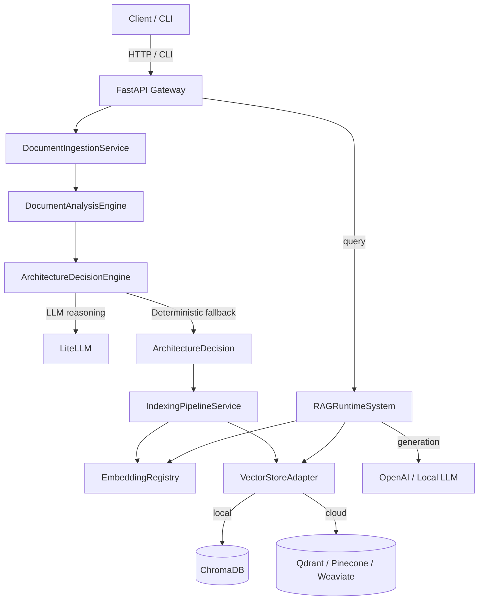

# AutoRAG Architect ⚡

[](https://github.com/yourusername/autorag-architect/actions/workflows/ci.yml)
[](https://www.python.org/downloads/)
[](LICENSE)
[](https://github.com/charliermarsh/ruff-pre-commit)

**AutoRAG Architect** analyses your document corpus and automatically designs, provisions, and serves the most optimal RAG (Retrieval-Augmented Generation) pipeline for it — selecting the right vector database, chunking strategy, embedding model, and LLM, then indexing your data and answering queries.

---

## ✨ Features

| Capability | Detail |
|-----------|--------|
| **Architecture Decision Engine** | Analyses token count, code presence, semantic density, and metadata richness to select the optimal vector DB, chunking strategy, and embedding model |
| **LLM-Powered Reasoning** | Optionally calls GPT-4o, Claude, Gemini, or any LiteLLM-supported model to override the deterministic engine with expert reasoning |
| **Multi-Format Ingestion** | PDF, DOCX, Markdown, TXT, HTML, CSV, JSON, Python, JS, TypeScript, Java, C++ |
| **Vector Store Abstraction** | ChromaDB (local), Qdrant, Pinecone, Weaviate, Milvus — swap without changing your pipeline code |
| **CLI Interface** | `autorag index`, `autorag query`, `autorag list`, `autorag serve` |
| **Production Docker** | docker-compose (dev) and docker-compose.prod.yml (PostgreSQL + Redis + Nginx) |

---

## 🏗 Architecture



---

## 🚀 Quickstart

### Option 1 — Docker (recommended)

```bash
cp .env.example .env   # fill in your API keys
make docker-up         # starts FastAPI + frontend
```

API: `http://localhost:8000/api/v1/docs`
Frontend: `http://localhost:3000`

### Option 2 — Local development

```bash
python -m venv venv && venv\Scripts\activate   # Windows
# OR: source venv/bin/activate                 # Unix/Mac

make setup          # installs deps + pre-commit hooks
make run-backend    # starts FastAPI on :8000
make run-frontend   # starts Next.js on :3000
```

### Option 3 — CLI

```bash
pip install -e ".[cli]"

# Index a folder of documents
autorag index ./data/ --verbose

# Query a project
autorag query <project-id> "What is the main theme of these documents?"

# List all indexed projects
autorag list
```

---

## ⚙️ Configuration

Copy `.env.example` to `.env` and set your keys:

```bash
OPENAI_API_KEY=sk-...       # Required for LLM generation
ALLOWED_ORIGINS=            # Empty = allow all (dev). Set in prod.
MAX_UPLOAD_MB=50            # File size limit
LOG_LEVEL=INFO
```

YAML configuration for chunking defaults, supported extensions, and decision thresholds lives in `configs/`:

- `configs/pipeline.yaml` — ingestion extensions, chunking defaults, decision thresholds
- `configs/model.yaml` — LLM model names, embedding model aliases, vector store defaults

---

## 🧪 Testing

```bash
make test              # run all tests
make test-cov          # with coverage report
pytest tests/test_decision_engine.py -v   # single module
```

Test coverage spans:
- Document ingestion (all formats + error conditions)
- Document analysis metrics
- Architecture decision engine (all branches)
- Indexing pipeline (mocked vector store)
- API routers (full HTTP integration tests)

---

## 🔌 Adding a New Vector Store

1. Create `src/engine/adapters/<name>.py` inheriting from `VectorStoreAdapter`
2. Implement `upsert()`, `as_retriever()`, `delete()`
3. Register in `ADAPTER_REGISTRY` in `src/engine/adapters.py`

No other files need to change.

---

## 🤝 Contributing

See [CONTRIBUTING.md](CONTRIBUTING.md). Run `make lint && make test` before submitting PRs.

## 📜 License

MIT — see [LICENSE](LICENSE).
